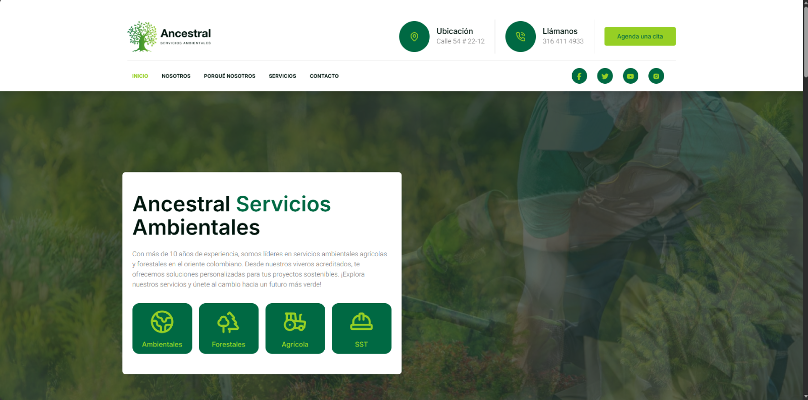
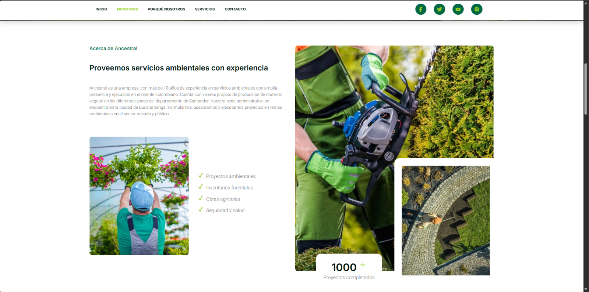
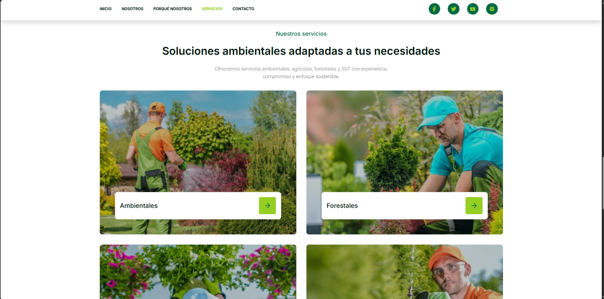
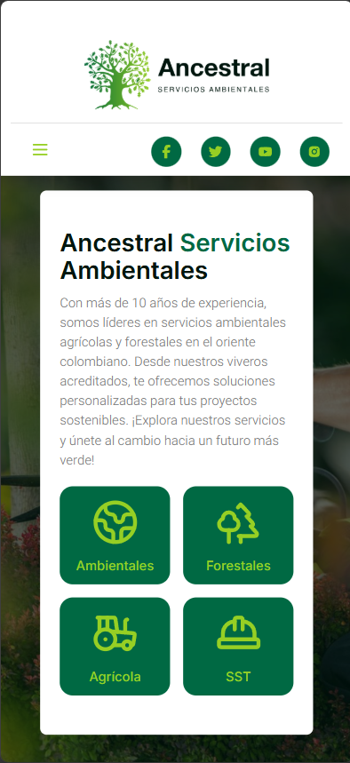
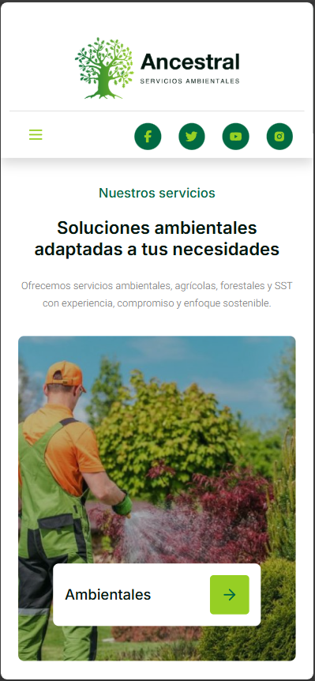
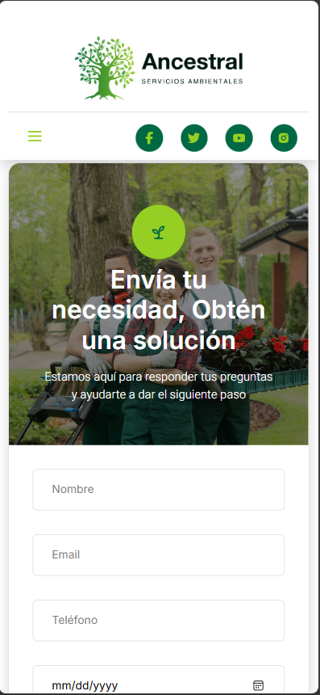
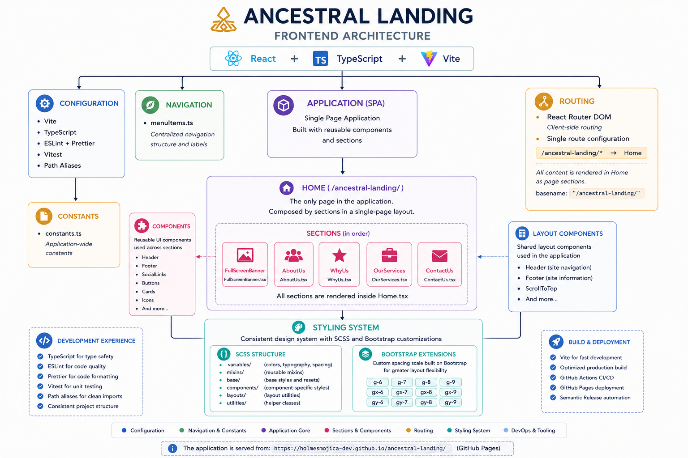

# 🌱 Ancestral Landing

Modern responsive landing page developed with **React, TypeScript, and Vite** for **Ancestral Servicios Ambientales**, a company focused on environmental, agricultural, forestry, and occupational health and safety services.

This project showcases a professional frontend architecture based on reusable components, configuration-driven design, a custom SCSS styling system, automated quality validation, CI/CD pipelines, semantic versioning, and automated deployment using GitHub Pages.

---

## 🔗 Live Demo

Visit the production application:

**https://holmesmojica-dev.github.io/ancestral-landing/**

---

## 🖼️ Application Preview

### Desktop Experience

<p align="center">
  
</p>

<p align="center">
  
  
</p>

### Mobile Experience

<p align="center">
  
  
  
</p>

---

## ⭐ Key Highlights

- Responsive design optimized for desktop and mobile devices.
- Modern React architecture using reusable components.
- Configuration-driven navigation and content management.
- SCSS design system with custom Bootstrap extensions.
- Automated testing and quality validation.
- Continuous Integration and Continuous Deployment (CI/CD).
- Semantic versioning and automated GitHub Releases.
- Automated production deployment with GitHub Pages.

---

# 🛠️ Technology Stack

The project is built using a modern frontend ecosystem focused on performance, maintainability, and scalability.

| Category           | Technologies                           |
| ------------------ | -------------------------------------- |
| Frontend Framework | React 18                               |
| Language           | TypeScript                             |
| Build Tool         | Vite                                   |
| Routing            | React Router DOM                       |
| Styling            | SCSS + Bootstrap 5                     |
| Testing            | Vitest + React Testing Library + jsdom |
| Code Quality       | ESLint + Prettier + SonarCloud         |
| CI/CD              | GitHub Actions                         |
| Release Management | Semantic Release                       |
| Deployment         | GitHub Pages                           |

---

# 🏗️ Frontend Architecture

The application follows a component-based architecture using a Single Page Application (SPA) approach.

The routing configuration uses a single `Home` page served from the `/ancestral-landing/` base path. The application is composed of reusable layout components and independent sections that are rendered inside the main page.

<p align="center">
  
</p>

### Architecture principles

- **Single Page Application (SPA)** architecture with React Router.
- **Component-based design** using reusable UI elements.
- **Section-driven layout** where `Home.tsx` orchestrates all application sections.
- **Configuration-driven navigation** using centralized configuration files.
- **SCSS design system** with reusable variables, mixins, and custom Bootstrap extensions.
- **Clean project organization** separating pages, sections, components, styles, and configuration.

---

# 🚀 Installation & Local Setup

### Prerequisites

Before running the project locally, make sure you have installed:

- Node.js 20+
- npm 10+

### Clone the repository

```bash
git clone https://github.com/holmesmojica-dev/ancestral-landing.git
```

### Navigate to the project directory

```bash
cd ancestral-landing
```

### Install dependencies

```bash
npm ci
```

### Start the development server

```bash
npm run dev
```

The application will be available at:

```text
http://localhost:5173/ancestral-landing/
```

---

# 📜 Available Scripts

The project provides the following npm commands:

| Command              | Description                                 |
| -------------------- | ------------------------------------------- |
| `npm run dev`        | Starts the Vite development server          |
| `npm run build`      | Creates an optimized production build       |
| `npm run preview`    | Runs the production build locally           |
| `npm run test:run`   | Executes all automated tests                |
| `npm run test:watch` | Runs tests in watch mode during development |
| `npm run coverage`   | Generates the test coverage report          |
| `npm run lint`       | Runs ESLint static analysis                 |
| `npm run format`     | Formats the project using Prettier          |

---

# 🧪 Testing & Code Quality

The project follows a quality-first development approach using automated validation and static analysis.

## Testing

Automated tests are implemented using:

- Vitest as the testing framework.
- React Testing Library for component behavior validation.
- jsdom to simulate browser APIs.

Tests are automatically executed as part of the CI pipeline, ensuring that new changes do not break existing functionality.

---

## Code Quality

The repository maintains consistent quality standards through:

- TypeScript type validation.
- ESLint static code analysis.
- Prettier formatting rules.
- SonarCloud continuous code inspection.
- Mandatory Quality Gates before merging Pull Requests.

---

## Development Workflow

All changes follow a standardized Git workflow:

1. Create a GitHub Issue.
2. Create a feature branch from `main`.
3. Implement the required changes.
4. Use Conventional Commit messages.
5. Open a Pull Request.
6. Validate all automated checks.
7. Perform Squash & Merge into `main`.

This process guarantees traceability, code quality, and a consistent repository history.

---

# 🔄 CI/CD & Automation

The project implements a complete automated software delivery lifecycle to ensure code quality, consistency, and reliable production deployments.

## Automated Quality Pipeline

Every change is validated through automated workflows including:

- TypeScript compilation validation
- ESLint static code analysis
- Prettier formatting validation
- Automated testing with Vitest
- SonarCloud static code analysis and Quality Gate verification

## Automated Release & Deployment

After a Pull Request is merged into the protected `main` branch:

1. Semantic Release evaluates Conventional Commit messages.
2. A new version and GitHub Release are automatically generated.
3. The production build is created.
4. The application is deployed automatically to GitHub Pages.

This process ensures that every production deployment has passed the required quality validations.

---

# 📚 Additional Documentation

The repository includes detailed technical documentation covering architecture, development standards, testing strategy, and CI/CD processes.

| Document                                                            | Description                                                                                                             |
| ------------------------------------------------------------------- | ----------------------------------------------------------------------------------------------------------------------- | --- |
| [🏗️ Frontend Architecture](./docs/architecture.md)                  | Project structure, component organization, configuration-driven approach, and SCSS styling architecture                 |
| [🛠️ Development Workflow](./docs/development.md)                    | Development standards, Git workflow, branch strategy, and Conventional Commits strategy                                 |
| [🔄 CI/CD & Automation](./docs/cicd.md)                             | GitHub Actions workflows, quality validation, Semantic Release, and deployment lifecycle                                |
| [🧪 Testing Strategy](./docs/testing.md)                            | Testing tools, philosophy, execution commands, and quality approach                                                     |
| [⚡ Frontend Optimization](./docs/quality/frontend-optimization.md) | Lighthouse analysis, image optimization, accessibility improvements, performance tuning, and final optimization results |     |

## 🖼️ Visual Documentation

The project also includes visual assets and evidence that complement the technical documentation:

| Asset                                                                                         | Description                                                                 |
| --------------------------------------------------------------------------------------------- | --------------------------------------------------------------------------- |
| [🏠 Application Desktop Preview](./docs/screenshots/application/desktop/home.png)             | Main desktop interface and application presentation                         |
| [📱 Mobile Responsive Experience](./docs/screenshots/application/mobile/home-mobile.png)      | Responsive design optimized for mobile devices                              |
| [🏗️ Frontend Architecture Diagram](./docs/screenshots/architecture/frontend-architecture.png) | Visual representation of the frontend architecture and project organization |
| [⚙️ CI/CD & Quality Evidence](./docs/screenshots/quality/github-actions.png)                  | Automated workflows, quality validation, and deployment evidence            |

---

# 👨‍💻 Author

Developed by **Holmes Mojica**.

- GitHub: https://github.com/holmesmojica-dev
- LinkedIn: https://linkedin.com/in/holmes-dennys-mojica-montero

---

# 📄 License

This project is licensed under the MIT License.

For more information, see the [LICENSE](./LICENSE) file.
